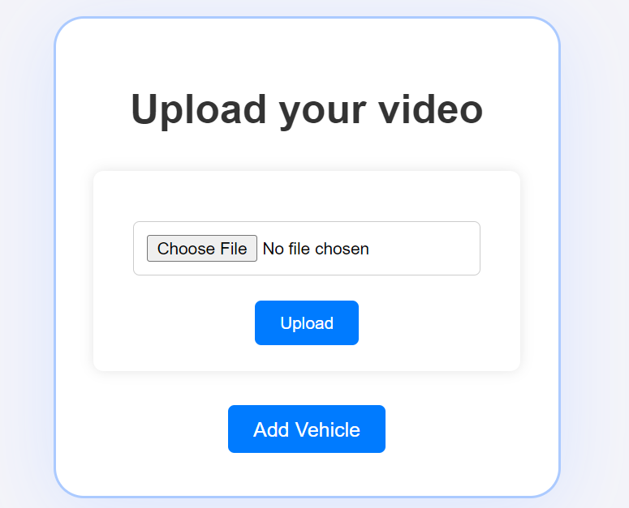
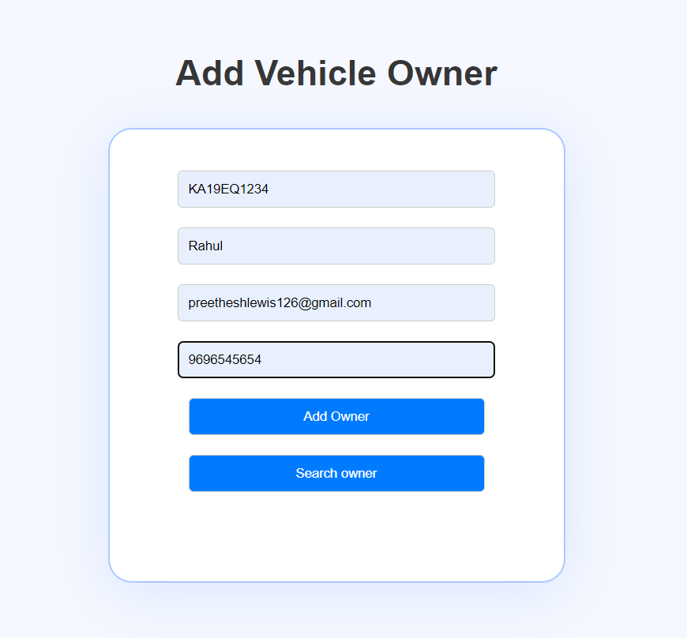
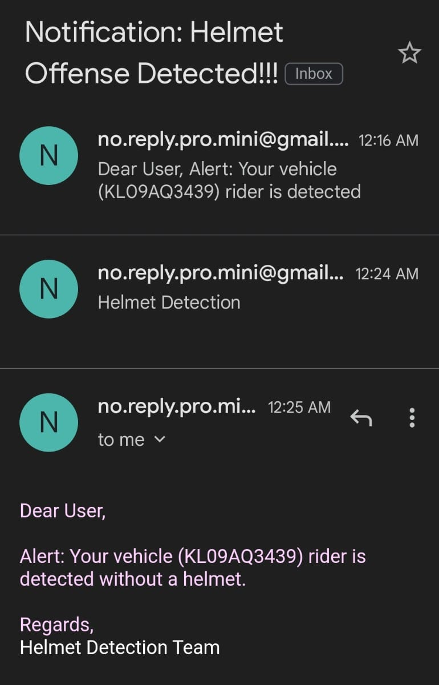

# Helmet-and-Number-Plate-Detection-and-Automated-Notification-using-Email

## Introduction 

This project based is a prototype for helmet detecting system, in which model detects the rider without helmet and number plate of the particular and automated email notification fetching details of the rider from the Database.

1. **Helmet Violation Detection**: This component of the project focuses on identifying motorcycle riders who are not wearing helmets. It uses computer vision techniques to analyze real-time camera feeds and instantly alerts authorities when a violation is detected.

2. **Capturing Bike Numbers**: The second component involves recognizing number plates and extracting number plate information from vehicles in real-time. This feature is valuable for law enforcement.

3. **Sending Email Notification**: The notification component is used for sending email notification for the user who violates the law of not wearing the helmet.

4. **Database: Fetching and Storing**: This mainly contains the script used for create table if not exists, insert and fetch data from the database.

## Helmet Missing Detection

The helmet missing detection module uses computer vision techniques to:

- Detect faces and riders on motorcycles.
- Determine whether the rider is wearing a helmet.
- Trigger alerts or notifications when a violation is detected.

## Capturing Bike Numbers

The number plate recognition module uses Optical Character Recognition (OCR) techniques to:

- Detect number plates on vehicles.
- Recognize the characters and display the number plate information in real-time.

## Dataset

- Acquired a comprehensive dataset from online sources containing 120 images with complete rider information, including the rider, helmet presence, and visible number plate and annotated it.

[Dataset](https://www.kaggle.com/datasets/aneesarom/rider-with-helmet-without-helmet-number-plate/data)

## Archietecture Used
- YOLO
- PaddleOcr

## Email Notification 
- An email is sent to the riders email if a personal not wearing helmet fetching the owners email from the database

## Upload Interface,Add Owner/Vehicle and Display Onwer Details 
- Uploading through interface and displaying the detected rider, person with or without helmet and number plate
- Add vehicle/Owner details interface for adding new vehicle into database
- Search Onwer Details for searching from database

## Flask Backend
 - Implemented backend service using flask framework for smooth working between frontend, model and database

## Database setup
- Simply run the MySQL script for creating a database using using shell or workbench
- After creating, setup the root name, password, database name
- Create table using script 

## Usage
- Get the dataset from above mentioned link and upoad both train , val dataset 
- Run the training.py and once it is completed run main.py (update model path to best.pt location in main.py)
- Interface opens upload video from video folder or any video of your choice

## Demo of Current Status
- A demo video has been saved in the Output Folder.

